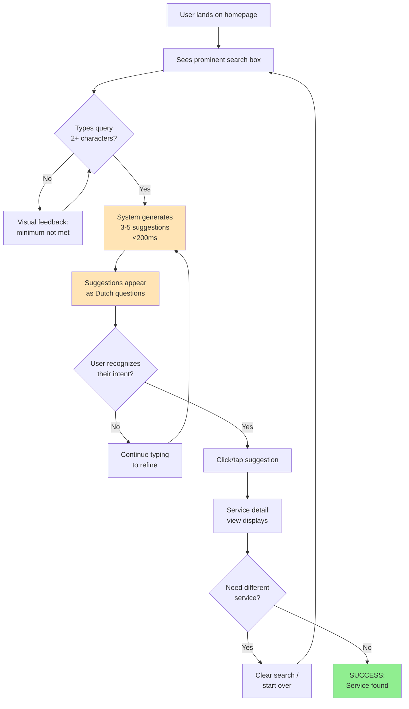
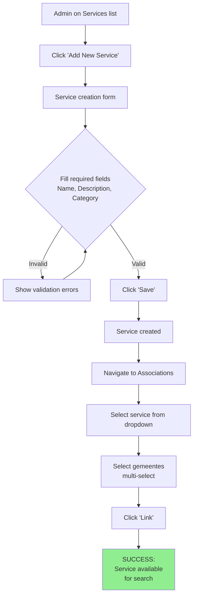
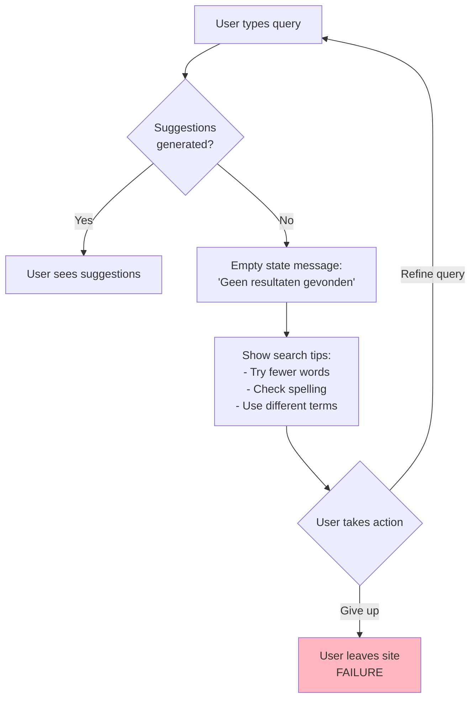
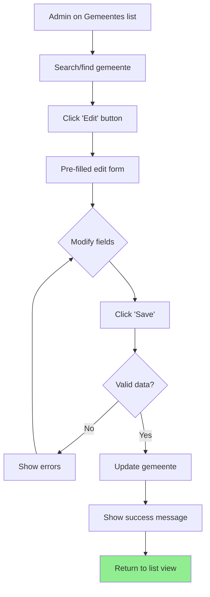
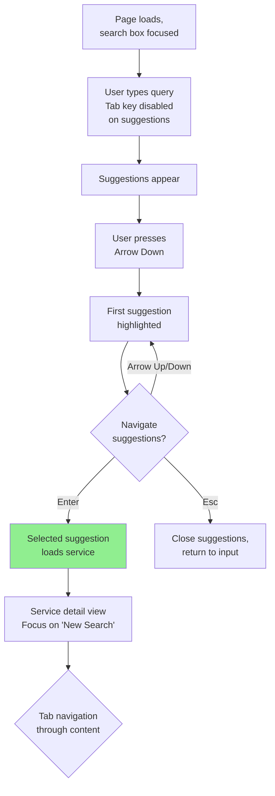

# ONLSuggest-v1 UX/UI Specification

_Generated on 2025-10-07 by Frank_

## Executive Summary

ONLSuggest is a proof-of-concept query suggestion system designed to help Dutch citizens discover municipal (gemeente) services through intelligent, question-based suggestions. Unlike traditional autocomplete or keyword search, the system transforms partial user input into natural, full-text Dutch questions that guide users to the services they need—without requiring knowledge of official government terminology.

**Project Scope:** Level 2 (Small complete system) - 8-12 stories, 2 epics, 4-8 week MVP

**Deployment Intent:** Demo/POC to validate the question-based suggestion approach and explore multiple UX interaction patterns

**Key Innovation:** Creating the perception that suggestions are pre-written (not algorithmically generated) through sub-200ms response times and contextually accurate question formation

**Target Audience:** Dutch citizens of all technical skill levels seeking municipal services, with a secondary admin interface for manual data curation

---

## 1. UX Goals and Principles

### 1.1 Target User Personas

#### Primary Persona: Maria - The Uncertain Citizen

**Demographics:**
- Age: 42
- Location: Amsterdam
- Technical Skill: Moderate (comfortable with basic web interfaces)
- Language: Native Dutch speaker

**Context & Goals:**
- Needs to apply for a parking permit but doesn't know the official terminology
- Wants quick, clear answers without navigating complex government websites
- Prefers conversational, natural language over technical jargon

**Pain Points:**
- Struggles with official government terminology ("parkeervergunning" vs "bewonersvergunning")
- Gets frustrated by autocomplete that requires exact keyword matches
- Abandons searches when forced to guess official service names

**Success Criteria:**
- Finds the right service within 2-3 interactions
- Feels confident that suggested questions match her intent
- Believes the system "understands" what she's looking for

#### Secondary Persona: Admin User - The Data Curator

**Role:** Municipal employee or system administrator
**Goals:** Maintain accurate gemeente and service data
**Needs:** Simple, efficient CRUD interface without technical complexity

### 1.2 Usability Goals

**1. Instant Responsiveness**
- Query suggestions appear within 200ms of typing
- No loading spinners or visible delays
- Creates perception of pre-generated, curated suggestions

**2. Effortless Discovery**
- Users find services without knowing official terminology
- Zero learning curve - familiar search box interaction
- Progressive disclosure prevents information overload

**3. Conversational Naturalness**
- Suggestions feel like questions a human would ask
- Dutch language patterns match natural speech
- System feels anticipatory, not algorithmic

**4. Universal Accessibility**
- WCAG 2.1 AA compliance for all user-facing features
- Keyboard navigation fully supported
- Clear visual feedback for all interactions
- Usable by citizens of all technical skill levels

**5. Trustworthy Intelligence**
- Suggestions are contextually accurate and relevant
- Graceful degradation when errors occur
- Clear, helpful fallback messaging

### 1.3 Design Principles

**1. Invisible Intelligence**
> "The system's intelligence should feel natural and anticipated, not algorithmic."

Users should believe suggestions are curated by experts, not generated in real-time. This requires exceptional speed, contextual accuracy, and natural language patterns that feel pre-written.

**2. Progressive Disclosure**
> "Start minimal and reveal complexity only when needed."

The interface begins with a single search box. Additional options, filters, or guidance appear contextually based on user actions. Avoid overwhelming users with upfront choices.

**3. Conversational Framing**
> "Present suggestions as questions users might ask, not system-centric categories."

Instead of "Parking Permits > Amsterdam > Resident", show "Hoe vraag ik een parkeervergunning aan in Amsterdam?" Mirror how humans naturally inquire about services.

**4. Instant Feedback**
> "No loading spinners or delays - suggestions appear as if they were already there."

Sub-200ms response times reinforce the "smart autocomplete" perception. Every interaction provides immediate visual feedback.

**5. Experimentation-First Architecture**
> "Design must support A/B testing multiple UX patterns without rebuilding core logic."

The system separates presentation (how suggestions appear) from generation (how suggestions are created), enabling rapid iteration on dropdown vs. cards, single vs. multi-column layouts, animation patterns, etc.

---

## 2. Information Architecture

### 2.1 Site Map

```
ONLSuggest Application
│
├── Public Interface (Citizen-Facing)
│   ├── Home / Search Page (primary entry point)
│   │   ├── Search Input Field
│   │   ├── Suggestion Results Display
│   │   └── Service Detail View (when suggestion selected)
│   │
│   └── [Future: About/Help pages - out of scope for POC]
│
└── Admin Interface (Authenticated)
    ├── Login Page (basic auth)
    ├── Dashboard (data overview)
    ├── Gemeentes Management
    │   ├── List View
    │   ├── Create/Edit Form
    │   └── Delete Confirmation
    ├── Services Management
    │   ├── List View
    │   ├── Create/Edit Form
    │   └── Delete Confirmation
    └── Associations Management
        └── Gemeente-Service Linking Interface
```

**Key Screens (7 total for POC):**
1. Public Search Interface
2. Service Results/Detail View
3. Admin Login
4. Admin Dashboard
5. Gemeente CRUD Interface
6. Service CRUD Interface
7. Association Management Interface

### 2.2 Navigation Structure

#### Public Interface Navigation

**Primary Navigation:** None (single-page focus)
- The public interface is intentionally minimal - just a search box
- Progressive disclosure: additional UI appears only after user interaction
- No traditional nav menu to avoid cognitive overload

**Navigation Pattern:**
- **Entry:** User lands on search page (prominent search box, minimal chrome)
- **Interaction:** User types → Suggestions appear → User selects → Results display
- **Reset:** Clear button or logo click returns to empty search state

**Mobile Navigation:**
- Same minimal approach (no hamburger menu needed)
- Search box remains primary focus
- Results adapt to smaller viewport

#### Admin Interface Navigation

**Primary Navigation:** Top-level tabs/menu
- Dashboard (overview)
- Gemeentes (manage municipalities)
- Services (manage service catalog)
- Associations (link services to gemeentes)
- Logout

**Secondary Navigation:** Within each section
- List views with search/filter
- Breadcrumbs for edit/create flows
- "Back to List" action after save/cancel

**Mobile Navigation (Admin):**
- Responsive menu (hamburger or bottom nav)
- Priority: Dashboard > Gemeentes > Services
- Touch-friendly targets (min 44x44px)

---

## 3. User Flows

### Flow 1: Primary Citizen Journey - Service Discovery via Query Suggestion

**User Goal:** Find municipal service without knowing official terminology
**Entry Point:** User lands on ONLSuggest homepage
**Success Criteria:** User finds relevant service within 2-3 interactions



**Key Interactions:**
- **Step 1-2:** Page load with focused search box (auto-focus on desktop)
- **Step 3-5:** Real-time suggestion generation with debounce (100-150ms typing delay)
- **Step 6-7:** Suggestion selection via click, tap, or keyboard (Enter/Arrow keys)
- **Step 8:** Service detail view with "New Search" CTA

**Error/Edge Cases:**
- **No suggestions found:** Display helpful message "Probeer andere zoektermen" (Try other search terms)
- **API timeout:** Show graceful fallback "Systeem tijdelijk niet beschikbaar" (System temporarily unavailable)
- **Empty input:** Disable/hide suggestion panel

---

### Flow 2: Admin - Adding New Service to Gemeente

**User Goal:** Add a new municipal service and associate it with gemeentes
**Entry Point:** Admin logged in, on Services page
**Success Criteria:** Service created and linked to relevant gemeentes



**Key Interactions:**
- **Form validation:** Real-time field validation with clear error messages
- **Multi-select:** Checkbox list or tag-based gemeente selection
- **Confirmation:** Success toast/message after save

---

### Flow 3: Citizen - No Results Recovery

**User Goal:** Recover from unsuccessful search attempt
**Entry Point:** User typed query but no relevant suggestions appeared
**Success Criteria:** User successfully refines search or finds alternative path



**Error Recovery Strategies:**
- Clear, non-technical Dutch error messages
- Actionable suggestions (not just "no results")
- Preserve user's input (don't clear search box)
- Consider future: "Did you mean...?" suggestions

---

### Flow 4: Admin - Editing Gemeente Information

**User Goal:** Update existing gemeente details
**Entry Point:** Admin dashboard or Gemeentes list
**Success Criteria:** Gemeente updated without breaking existing associations



---

### Flow 5: Citizen - Keyboard-Only Navigation

**User Goal:** Complete search using only keyboard (accessibility requirement)
**Entry Point:** User lands on page, does not use mouse/touch
**Success Criteria:** Full interaction flow completable via keyboard



**Keyboard Shortcuts:**
- **Tab:** Navigate form fields (admin) - NOT suggestion list
- **Arrow Up/Down:** Navigate suggestion list
- **Enter:** Select highlighted suggestion
- **Esc:** Close suggestions, return focus to search input
- **Cmd/Ctrl + K:** Focus search box (future enhancement)

---

## 4. Component Library and Design System

### 4.1 Design System Approach

**Strategy: Lightweight Custom Library with Utility Framework**

Given the POC nature and experimentation-first requirement, we'll use a **hybrid approach**:

**Base:** Tailwind CSS (utility-first framework)
- Enables rapid prototyping and A/B testing of different layouts
- Easy to experiment with dropdown vs. card layouts without rebuilding components
- Excellent responsive design utilities
- Built-in accessibility features (focus states, screen reader utilities)

**Custom Components:** React/Vue component library (TBD by architect)
- **SearchBox** - Core input component with debounce logic
- **SuggestionList** - Flexible suggestion display (supports multiple presentation modes)
- **SuggestionItem** - Individual suggestion card/row
- **ServiceDetail** - Result display component
- **AdminForm** - Reusable CRUD form components
- **AdminTable** - Data list/table for gemeentes and services

**Why NOT a full design system (Material UI, Ant Design)?**
- Too opinionated for experimentation
- Harder to A/B test radically different UX patterns
- Unnecessary complexity for 7-screen POC
- Want custom Dutch government aesthetic (not generic corporate)

**Design Tokens:** Defined in CSS variables/Tailwind config
- Colors (primary, secondary, success, error, neutrals)
- Typography scale (font sizes, weights, line heights)
- Spacing scale (4px base grid)
- Border radius, shadows, transitions

**Benefits for Experimentation:**
- Can quickly switch between dropdown and card layouts by changing component props
- Tailwind utility classes enable rapid iteration
- Custom components ensure consistent behavior (debounce, keyboard nav) across UI variations

### 4.2 Core Components

#### Component 1: SearchBox

**Purpose:** Primary input field for citizen queries

**Variants:**
- Default (empty state)
- Focused (user actively typing)
- With suggestions (overlay/dropdown visible)

**States:**
- Default: Placeholder text "Zoek naar gemeentediensten..." (Search for municipal services)
- Focused: Blue border, placeholder fades, cursor active
- Typing: Character counter if <2 chars, debounce indicator (subtle)
- Error: Red border if API fails
- Disabled: Grayed out (admin interface edge case)

**Props/Configuration:**
- `minChars` (default: 2)
- `debounceMs` (default: 150)
- `placeholder` (configurable Dutch text)
- `autoFocus` (true on desktop, false on mobile)

**Accessibility:**
- `role="combobox"`
- `aria-expanded` when suggestions visible
- `aria-autocomplete="list"`
- Clear focus indicator (2px blue outline)

---

#### Component 2: SuggestionList

**Purpose:** Display 3-5 suggestion results

**Variants:**
- **Dropdown** (default) - Appears below search box, overlays content
- **Card Grid** (experimental) - Cards below search box, pushes content down
- **Side Panel** (experimental) - Slides in from right on desktop

**States:**
- Loading: Subtle shimmer/skeleton (only if >200ms delay)
- Populated: 3-5 suggestion items displayed
- Empty: "Geen resultaten gevonden" message with tips
- Error: Fallback message with retry option

**Behavior:**
- Auto-dismiss on: click outside, Esc key, input cleared
- Keyboard navigation: Arrow keys cycle through items
- First item NOT auto-selected (prevent accidental selection)

---

#### Component 3: SuggestionItem

**Purpose:** Individual suggestion (question format)

**Variants:**
- Dropdown row (compact)
- Card (more spacious, icon optional)

**States:**
- Default: White background, gray text
- Hover: Light blue background, pointer cursor
- Focused (keyboard): Blue border, blue background
- Active/Pressed: Darker blue background

**Content Structure:**
```
[Optional Icon/Badge]  "Hoe vraag ik een parkeervergunning aan in Amsterdam?"
                        ↳ Amsterdam • Parkeren • Vergunningen
                        (gemeente • service category • type - subtle gray text)
```

**Accessibility:**
- `role="option"`
- `aria-selected` for keyboard focus
- Minimum touch target: 44x44px
- Clear visual focus indicator

---

#### Component 4: ServiceDetail

**Purpose:** Display full service information after selection

**Content Sections:**
1. **Header:** Service name, gemeente badge
2. **Description:** What the service is, who needs it
3. **Requirements:** What you need to apply
4. **How to Apply:** Steps, links to official forms
5. **Contact:** Phone, email, office hours
6. **New Search CTA:** Prominent "Nieuwe zoekopdracht" button

**States:**
- Loading: Skeleton layout (title, paragraph placeholders)
- Loaded: Full content
- Error: "Service niet beschikbaar" with back button

---

#### Component 5: AdminForm (Reusable)

**Purpose:** CRUD forms for gemeentes, services, associations

**Common Elements:**
- Text inputs (name, description)
- Dropdowns (category selection)
- Multi-select (gemeente-service linking)
- Save/Cancel buttons
- Validation error display

**States:**
- Editing: Pre-filled values, "Save Changes" CTA
- Creating: Empty fields, "Create" CTA
- Saving: Disabled fields, loading indicator on button
- Success: Toast notification, redirect to list
- Error: Inline field errors, keep form data

---

#### Component 6: AdminTable

**Purpose:** List gemeentes or services with actions

**Features:**
- Search/filter input
- Sortable columns (name, created date)
- Pagination (if >50 items)
- Row actions: Edit, Delete
- Bulk actions (future: delete multiple)

**States:**
- Loading: Table skeleton
- Empty: "Geen items gevonden" with "Create" CTA
- Populated: Data rows with hover effects
- Deleting: Confirmation modal overlay

---

## 5. Visual Design Foundation

### 5.1 Color Palette

**Brand Personality:** Professional, trustworthy, accessible (Dutch government service aesthetic)

**Primary Colors:**

| Color     | Hex     | Usage                                          |
| --------- | ------- | ---------------------------------------------- |
| Blue-600  | #2563EB | Primary actions, links, focus states           |
| Blue-500  | #3B82F6 | Hover states, active elements                  |
| Blue-100  | #DBEAFE | Light backgrounds, subtle highlights           |
| Blue-50   | #EFF6FF | Very subtle backgrounds, hover backgrounds     |

**Semantic Colors:**

| Color      | Hex     | Usage                                          |
| ---------- | ------- | ---------------------------------------------- |
| Green-600  | #16A34A | Success messages, confirmations                |
| Green-100  | #DCFCE7 | Success backgrounds                            |
| Red-600    | #DC2626 | Errors, destructive actions                    |
| Red-100    | #FEE2E2 | Error backgrounds                              |
| Yellow-600 | #CA8A04 | Warnings, important notices                    |
| Yellow-100 | #FEF9C3 | Warning backgrounds                            |

**Neutral Colors:**

| Color    | Hex     | Usage                                          |
| -------- | ------- | ---------------------------------------------- |
| Gray-900 | #111827 | Primary text                                   |
| Gray-700 | #374151 | Secondary text                                 |
| Gray-500 | #6B7280 | Tertiary text, placeholders                    |
| Gray-300 | #D1D5DB | Borders, dividers                              |
| Gray-100 | #F3F4F6 | Subtle backgrounds, admin interface            |
| Gray-50  | #F9FAFB | Page backgrounds                               |
| White    | #FFFFFF | Component backgrounds, cards                   |

**Rationale:**
- Blue conveys trust and government authority (common in Dutch gov sites)
- High contrast ratios ensure WCAG 2.1 AA compliance (4.5:1 for text)
- Semantic colors follow universal conventions (green=success, red=error)

### 5.2 Typography

**Font Families:**

**Primary Font:** Inter (sans-serif)
- **Why:** Excellent Dutch character support (ë, ï, ü), optimized for screens, open-source
- **Weights:** 400 (Regular), 500 (Medium), 600 (Semibold), 700 (Bold)
- **Fallback:** system-ui, -apple-system, BlinkMacSystemFont, "Segoe UI", Arial, sans-serif

**Monospace Font (optional, admin only):** JetBrains Mono
- **Usage:** IDs, technical fields in admin interface
- **Fallback:** "Courier New", monospace

**Type Scale:**

| Element              | Size   | Weight | Line Height | Usage                               |
| -------------------- | ------ | ------ | ----------- | ----------------------------------- |
| **Display**          | 48px   | 700    | 1.1         | Marketing/landing (out of scope)    |
| **H1**               | 36px   | 700    | 1.2         | Page titles (admin dashboard)       |
| **H2**               | 30px   | 600    | 1.3         | Section headings                    |
| **H3**               | 24px   | 600    | 1.4         | Subsection headings                 |
| **H4**               | 20px   | 600    | 1.4         | Component headings                  |
| **Body Large**       | 18px   | 400    | 1.6         | Suggestion questions (primary)      |
| **Body**             | 16px   | 400    | 1.5         | Standard text, form labels          |
| **Body Small**       | 14px   | 400    | 1.5         | Metadata, secondary info            |
| **Caption**          | 12px   | 500    | 1.4         | Helper text, field hints            |

**Special Styling:**

- **Suggestion Questions (Primary Use Case):** 18px, Medium (500), Blue-600
  - Slightly larger and heavier than body text to emphasize conversational questions
  - Line height 1.6 for comfortable Dutch text reading (longer words)

- **Placeholder Text:** 16px, Regular (400), Gray-500, italic

**Rationale:**
- 16px base ensures readability on all devices (WCAG minimum)
- 1.5-1.6 line height accommodates Dutch language (compound words can be long)
- Medium weight (500) for suggestion questions makes them feel "clickable" without being too heavy

### 5.3 Spacing and Layout

**Spacing Scale (4px base grid):**

| Token | Value | Usage                                       |
| ----- | ----- | ------------------------------------------- |
| xs    | 4px   | Tight spacing (icon-text gap)               |
| sm    | 8px   | Component internal padding                  |
| md    | 16px  | Standard spacing (between elements)         |
| lg    | 24px  | Section spacing                             |
| xl    | 32px  | Major section breaks                        |
| 2xl   | 48px  | Page-level spacing (hero to content)        |
| 3xl   | 64px  | Dramatic spacing (landing pages)            |

**Layout Grid:**

**Public Interface (Citizen):**
- **Max Content Width:** 640px (readable line length for Dutch text)
- **Horizontal Padding:** 16px mobile, 24px tablet+
- **Centered:** Search box and results centered in viewport

**Admin Interface:**
- **Max Content Width:** 1280px (tables need more width)
- **Horizontal Padding:** 24px mobile, 32px desktop
- **Sidebar (if used):** 256px fixed width on desktop, collapsed on mobile

**Component Spacing Rules:**

1. **Search Box:**
   - Height: 48px (comfortable touch target)
   - Padding: 12px horizontal, 16px vertical
   - Margin bottom: 16px (before suggestions appear)

2. **Suggestion Items:**
   - Padding: 12px horizontal, 16px vertical
   - Gap between items: 2px (subtle separation)
   - Margin: 8px from search box (dropdown mode)

3. **Form Fields:**
   - Label margin-bottom: 4px
   - Field margin-bottom: 16px
   - Error text margin-top: 4px

4. **Buttons:**
   - Padding: 8px 16px (small), 12px 24px (medium), 16px 32px (large)
   - Minimum width: 120px (prevents awkward narrow buttons)
   - Gap between buttons: 12px

**Border Radius:**
- **sm:** 4px (inputs, small elements)
- **md:** 8px (cards, buttons)
- **lg:** 12px (modal dialogs, panels)
- **full:** 9999px (pills, badges)

**Elevation/Shadows:**

| Level   | Value                                        | Usage                         |
| ------- | -------------------------------------------- | ----------------------------- |
| sm      | 0 1px 2px rgba(0,0,0,0.05)                   | Subtle depth (input borders)  |
| md      | 0 4px 6px rgba(0,0,0,0.1)                    | Dropdown, suggestions         |
| lg      | 0 10px 15px rgba(0,0,0,0.1)                  | Modal dialogs                 |
| xl      | 0 20px 25px rgba(0,0,0,0.15)                 | Dramatic elevation (rarely)   |

**Transitions:**
- **Duration:** 150ms (default), 300ms (complex animations)
- **Easing:** cubic-bezier(0.4, 0, 0.2, 1) (ease-in-out)
- **Apply to:** background-color, border-color, box-shadow, transform

---

## 6. Responsive Design

### 6.1 Breakpoints

**Tailwind CSS Standard Breakpoints:**

| Breakpoint | Min Width | Target Devices                    | Layout Strategy                  |
| ---------- | --------- | --------------------------------- | -------------------------------- |
| **sm**     | 640px     | Large phones (landscape), tablets | Single column with more padding  |
| **md**     | 768px     | Tablets (portrait)                | Admin: Consider 2-column layouts |
| **lg**     | 1024px    | Tablets (landscape), small laptops| Admin: Full navigation visible   |
| **xl**     | 1280px    | Desktops                          | Max content width, extra spacing |
| **2xl**    | 1536px    | Large desktops                    | Maintain max-width constraints   |

**Design Approach:** Mobile-first (base styles for mobile, progressively enhance)

**Key Breakpoint Usage:**

- **Base (< 640px):** Mobile phones
  - Single-column layout
  - Full-width search box
  - Stacked suggestions (dropdown fills screen width)
  - Admin: Hamburger menu, simplified tables

- **sm (640px+):** Large phones, small tablets
  - Slightly increased padding
  - Admin: Still mobile navigation

- **md (768px+):** Tablets
  - Search box max-width: 640px (centered)
  - Admin: Tablet-optimized tables, possible sidebar

- **lg (1024px+):** Desktop
  - Full desktop experience
  - Admin: Sidebar navigation visible, multi-column forms
  - Keyboard shortcuts active (auto-focus search)

- **xl (1280px+):** Large desktops
  - Maintain readability (don't stretch infinitely)
  - More generous whitespace

### 6.2 Adaptation Patterns

**Public Search Interface:**

**Mobile (< 640px):**
- Search box: Full width with 16px horizontal padding
- Suggestions: Dropdown fills screen width, overlays content
- Suggestion items: 48px height (touch-friendly)
- Service detail: Full-screen view with back button
- No auto-focus (prevents keyboard popping up unexpectedly)

**Desktop (1024px+):**
- Search box: 640px max-width, centered
- Suggestions: Dropdown with 640px width (matches search box)
- Suggestion items: 56px height (more spacious)
- Service detail: Modal overlay or inline expansion
- Auto-focus search box on page load

**Admin Interface:**

**Mobile (< 768px):**
- Navigation: Hamburger menu (top-right)
- Tables: Horizontal scroll or card-based view
- Forms: Single-column, full-width fields
- Actions: Full-width buttons stacked vertically

**Tablet (768px - 1023px):**
- Navigation: Bottom tab bar or collapsible sidebar
- Tables: Responsive table (hide less critical columns)
- Forms: Still single-column, but more padding

**Desktop (1024px+):**
- Navigation: Fixed left sidebar (256px)
- Tables: Full table view, all columns visible
- Forms: 2-column layout for related fields
- Actions: Inline buttons (Save/Cancel side-by-side)

**Component-Specific Adaptations:**

**SuggestionList:**
- Mobile: Dropdown mode only (overlays)
- Desktop: Support experimental modes (card grid, side panel)

**ServiceDetail:**
- Mobile: Full-screen overlay with close (X) button
- Desktop: Modal (800px width) or inline expansion below suggestions

**AdminTable:**
- Mobile: Card view (each row = card with key info)
- Tablet: Horizontal scroll with sticky first column
- Desktop: Full table with sorting, filtering visible

---

## 7. Accessibility

### 7.1 Compliance Target

**Target Level:** WCAG 2.1 Level AA

**Rationale:**
- Government services require high accessibility (legal requirement in many jurisdictions)
- Level AA is achievable for POC timeline (Level AAA adds significant complexity)
- Ensures usability for citizens with disabilities (screen readers, keyboard-only, low vision)

**Compliance Scope:**
- **Public Interface:** Full WCAG 2.1 AA compliance (citizen-facing, critical)
- **Admin Interface:** WCAG 2.1 AA compliance (internal tool, still important for inclusive hiring)

### 7.2 Key Requirements

**1. Perceivable**

**Color Contrast:**
- Text: Minimum 4.5:1 contrast ratio (normal text), 3:1 (large text 18px+)
- UI Components: 3:1 contrast for interactive elements (buttons, form fields)
- Verified color combinations:
  - Gray-900 on White: 19.08:1 ✅
  - Blue-600 on White: 8.59:1 ✅
  - Gray-500 on White: 4.57:1 ✅

**Text Alternatives:**
- All icons have aria-labels
- Search box has descriptive label (visually hidden if needed)
- Suggestion metadata (gemeente • service) has semantic markup

**Adaptable Content:**
- Semantic HTML5 (header, nav, main, section)
- Proper heading hierarchy (h1 → h2 → h3, no skipping)
- Lists use `<ul>`, `<ol>` appropriately

---

**2. Operable**

**Keyboard Navigation:**
- All functionality accessible via keyboard (no mouse-only actions)
- Focus indicators visible (2px blue outline, never `outline: none` without replacement)
- Logical tab order (search → suggestions → service detail → admin nav)
- Keyboard shortcuts:
  - Arrow keys: Navigate suggestions
  - Enter: Select highlighted suggestion
  - Esc: Close suggestions, return to search
  - Tab/Shift+Tab: Navigate form fields (admin)

**No Keyboard Traps:**
- Modals have proper focus management (trap focus inside, Esc to close)
- Dropdowns can be dismissed with Esc

**Timing:**
- No time limits on user interactions (POC has no session timeouts)
- Debounce (150ms) doesn't create accessibility barrier

---

**3. Understandable**

**Readable:**
- Language attribute: `<html lang="nl">` (Dutch)
- Font size: Minimum 16px (body text)
- Line height: 1.5-1.6 for readability

**Predictable:**
- Consistent navigation (admin interface)
- No unexpected context changes (new windows warned, modals clear)
- Form labels always visible (no placeholder-only inputs)

**Input Assistance:**
- Clear error messages in Dutch ("Dit veld is verplicht" = This field is required)
- Errors associated with fields via aria-describedby
- Success messages announced to screen readers (aria-live="polite")

---

**4. Robust**

**Compatible:**
- Valid HTML5 (no duplicate IDs, proper nesting)
- ARIA roles used correctly:
  - `role="combobox"` for search box
  - `role="listbox"` for suggestion list
  - `role="option"` for suggestion items
  - `aria-expanded`, `aria-selected`, `aria-activedescendant` for autocomplete

**Screen Reader Support:**
- Tested with: NVDA (Windows), JAWS (Windows), VoiceOver (macOS/iOS)
- Suggestion count announced: "3 suggesties beschikbaar" (3 suggestions available)
- Selection announced: "Geselecteerd: [question text]"

---

**Testing Checklist:**

- [ ] Axe DevTools scan passes with 0 critical issues
- [ ] Keyboard-only navigation test (Tab, Enter, Esc, Arrows)
- [ ] Screen reader test (VoiceOver on macOS minimum)
- [ ] Color contrast verification (all text/UI components)
- [ ] Zoom to 200% test (layout doesn't break, no horizontal scroll)
- [ ] Focus indicator visible on all interactive elements

---

## 8. Interaction and Motion

### 8.1 Motion Principles

**Philosophy:** Subtle, purposeful motion that enhances usability without drawing attention to itself

**Core Principles:**

1. **Functional, Not Decorative**
   - Animations serve a purpose: provide feedback, guide attention, smooth transitions
   - No motion for motion's sake

2. **Fast and Snappy**
   - Default: 150ms (feels instant but smooth)
   - Complex: 300ms maximum (anything longer feels sluggish)
   - POC requirement: Sub-200ms suggestions mean minimal loading animations

3. **Respect User Preferences**
   - Honor `prefers-reduced-motion` media query
   - Reduce or eliminate animations for users who request it
   - Critical for accessibility (motion can trigger vestibular disorders)

4. **Easing Creates Naturalness**
   - Use ease-in-out for most transitions (cubic-bezier)
   - Avoid linear easing (feels robotic)
   - Ease-out for entering elements (quick start, slow end)
   - Ease-in for exiting elements (slow start, quick end)

### 8.2 Key Animations

**1. Suggestion Dropdown Appearance**

**Trigger:** User types 2+ characters
**Animation:** Fade in + slide down (8px)
**Duration:** 150ms
**Easing:** ease-out

```css
@keyframes dropdown-appear {
  from {
    opacity: 0;
    transform: translateY(-8px);
  }
  to {
    opacity: 1;
    transform: translateY(0);
  }
}
```

**Reduced Motion Alternative:** Instant appearance (opacity 0 → 1, no transform)

---

**2. Suggestion Item Hover**

**Trigger:** Mouse hover or keyboard focus
**Animation:** Background color transition
**Duration:** 100ms (very fast for responsiveness)
**Easing:** ease-in-out

```css
.suggestion-item {
  transition: background-color 100ms cubic-bezier(0.4, 0, 0.2, 1);
}
```

**Reduced Motion:** No change (instant color switch acceptable)

---

**3. Search Input Focus**

**Trigger:** Click/tap or keyboard focus on search box
**Animation:** Border color + subtle glow (box-shadow)
**Duration:** 150ms
**Easing:** ease-out

```css
.search-input:focus {
  border-color: #2563EB; /* Blue-600 */
  box-shadow: 0 0 0 3px rgba(37, 99, 235, 0.1);
  transition: border-color 150ms ease-out, box-shadow 150ms ease-out;
}
```

**Reduced Motion:** Instant border color change, no shadow animation

---

**4. Loading Skeleton (if needed)**

**Trigger:** API request >200ms
**Animation:** Subtle shimmer effect
**Duration:** 1500ms loop
**Easing:** ease-in-out

```css
@keyframes shimmer {
  0% {
    background-position: -200px 0;
  }
  100% {
    background-position: 200px 0;
  }
}

.skeleton {
  background: linear-gradient(90deg, #f3f4f6 25%, #e5e7eb 50%, #f3f4f6 75%);
  background-size: 200px 100%;
  animation: shimmer 1.5s infinite ease-in-out;
}
```

**Reduced Motion:** Static gray background, no shimmer

---

**5. Modal/ServiceDetail Appearance**

**Trigger:** User clicks suggestion
**Animation:** Fade in + scale up slightly
**Duration:** 200ms
**Easing:** ease-out

```css
@keyframes modal-appear {
  from {
    opacity: 0;
    transform: scale(0.95);
  }
  to {
    opacity: 1;
    transform: scale(1);
  }
}
```

**Backdrop:** Fade in over 200ms
**Reduced Motion:** Instant appearance

---

**6. Button Press (Micro-interaction)**

**Trigger:** Click/tap on button
**Animation:** Subtle scale down (0.98)
**Duration:** 50ms (very fast, just tactile feedback)
**Easing:** ease-in-out

```css
.button:active {
  transform: scale(0.98);
  transition: transform 50ms ease-in-out;
}
```

**Reduced Motion:** No change (or instant)

---

**7. Toast Notification (Success/Error)**

**Trigger:** Admin action completed (save, delete)
**Animation:** Slide in from top + fade in
**Duration:** 300ms enter, 200ms exit
**Easing:** ease-out (enter), ease-in (exit)

```css
@keyframes toast-enter {
  from {
    opacity: 0;
    transform: translateY(-16px);
  }
  to {
    opacity: 1;
    transform: translateY(0);
  }
}

@keyframes toast-exit {
  from {
    opacity: 1;
    transform: translateY(0);
  }
  to {
    opacity: 0;
    transform: translateY(-16px);
  }
}
```

**Auto-dismiss:** After 4 seconds (accessible: users can close manually)
**Reduced Motion:** Instant appearance/disappearance

---

**Reduced Motion Implementation:**

```css
@media (prefers-reduced-motion: reduce) {
  *,
  *::before,
  *::after {
    animation-duration: 0.01ms !important;
    animation-iteration-count: 1 !important;
    transition-duration: 0.01ms !important;
  }
}
```

**Testing:**
- [ ] All animations respect `prefers-reduced-motion`
- [ ] No animation longer than 300ms
- [ ] Animations enhance, not hinder usability
- [ ] Test on low-end devices (no jank)

---

## 9. Design Files and Wireframes

### 9.1 Design Files

**Status:** High-fidelity designs to be created in Figma (recommended for POC)

**Recommended Figma Structure:**

```
ONLSuggest-POC/
├── 📄 Cover (project overview, design principles)
├── 🎨 Design Tokens (colors, typography, spacing variables)
├── 🧩 Components (all 6 core components with variants)
├── 📱 Screens - Public Interface
│   ├── 1.0 Search (Empty State)
│   ├── 1.1 Search (Typing - <2 chars)
│   ├── 1.2 Search (Suggestions - Dropdown)
│   ├── 1.3 Search (Suggestions - Card Grid) [Experimental]
│   ├── 1.4 Service Detail (Modal)
│   └── 1.5 Error States
├── 💼 Screens - Admin Interface
│   ├── 2.0 Login
│   ├── 2.1 Dashboard
│   ├── 2.2 Gemeentes List
│   ├── 2.3 Gemeentes Create/Edit
│   ├── 2.4 Services List
│   ├── 2.5 Services Create/Edit
│   └── 2.6 Associations Management
├── 📲 Mobile Variants
│   └── (Mobile versions of key screens)
└── 🔄 User Flows (with Figjam or FigJam)
```

**Design Handoff:**
- Component specs exported as dev-ready assets
- Design tokens exported as JSON for Tailwind config
- Annotated screens with spacing, interactions notes

**Alternative (Faster POC):** Skip Figma, implement directly from this UX spec using Tailwind + component library

### 9.2 Key Screen Layouts

#### Screen 1: Public Search Interface (Empty State)

**Layout:**
```
┌─────────────────────────────────────────────┐
│                                             │
│              [ONLSuggest Logo]              │  <- Centered, 48px margin-top
│                                             │
│     ┌─────────────────────────────────┐    │
│     │  Zoek naar gemeentediensten... │    │  <- Search box: 640px max-width
│     │  🔍                             │    │     48px height, auto-focused
│     └─────────────────────────────────┘    │
│                                             │
│   Typ minimaal 2 tekens om suggesties...   │  <- Helper text (Gray-500, 14px)
│                                             │
└─────────────────────────────────────────────┘
```

**Key Elements:**
- Vertical centering on desktop (100vh)
- Logo: 120px width
- Search box prominence: Large, centered, high-contrast border
- Minimal distractions: No navigation, no footer initially

---

#### Screen 2: Public Search Interface (With Suggestions - Dropdown)

**Layout:**
```
┌─────────────────────────────────────────────┐
│              [ONLSuggest Logo]              │
│                                             │
│     ┌─────────────────────────────────┐    │
│     │  parkeren█                      │    │  <- User input
│     └─────────────────────────────────┘    │
│     ┌─────────────────────────────────┐    │  <- Dropdown (shadow-md)
│     │ 🏛️ Hoe vraag ik een parkeer-   │    │     18px Medium Blue-600
│     │    vergunning aan in Amsterdam? │    │
│     │    ↳ Amsterdam • Parkeren       │    │     14px Gray-500
│     ├─────────────────────────────────┤    │  <- 2px separator
│     │ 🏛️ Waar kan ik een bewoners-   │    │
│     │    vergunning parkeren aanv...  │    │
│     │    ↳ Amsterdam • Parkeren       │    │
│     ├─────────────────────────────────┤    │
│     │ 🏛️ Wat kost een parkeervergun- │    │
│     │    ning in Amsterdam?           │    │
│     │    ↳ Amsterdam • Parkeren       │    │
│     └─────────────────────────────────┘    │
│                                             │
│   3 suggesties beschikbaar                  │  <- Screen reader announcement
└─────────────────────────────────────────────┘
```

**Interaction States:**
- Hover: Light blue background (#EFF6FF)
- Keyboard focus: Blue border + blue background
- Click: Navigate to service detail

---

#### Screen 3: Admin Dashboard

**Layout:**
```
┌─────────────────────────────────────────────────────────────┐
│ ┌─────────────┐                                             │
│ │ ONLSuggest  │  Dashboard            [Admin User ▼] Logout │  <- Top bar
│ │ Admin       │                                             │
│ ├─────────────┤                                             │
│ │ 📊 Dashboard│  ┌──────────────────────────────────────┐  │
│ │ 🏛️ Gemeentes│  │  Data Overview                       │  │
│ │ 📋 Services │  ├──────────────────────────────────────┤  │
│ │ 🔗 Links    │  │  Gemeentes: 47    [View All →]      │  │  <- Cards
│ └─────────────┘  │  Services:  132   [View All →]      │  │
│                  │  Associations: 284 [View All →]      │  │
│   256px sidebar  └──────────────────────────────────────┘  │
│                                                             │
│                  ┌──────────────────────────────────────┐  │
│                  │  Recent Activity                     │  │
│                  ├──────────────────────────────────────┤  │
│                  │  • Service "Paspoort" updated        │  │
│                  │  • Gemeente "Rotterdam" added        │  │
│                  └──────────────────────────────────────┘  │
└─────────────────────────────────────────────────────────────┘
```

**Key Elements:**
- Fixed left sidebar navigation
- Card-based dashboard stats
- Action buttons on each card
- Recent activity feed

---

## 10. Next Steps

### 10.1 Immediate Actions

**For Frank (Project Owner):**

1. **✅ UX Specification Complete** - This document now exists at `/docs/ux-specification.md`

2. **Next: Return to Architect (Winston)**
   - The solution architecture workflow requires this UX spec
   - Run: `/bmad:bmm:agents:architect` → Select option 1 (*solution-architecture*)
   - Winston will use this UX spec to inform:
     - Frontend architecture and component structure
     - API design (driven by screen data needs)
     - State management strategy
     - Technology choices (component libraries)
     - Performance requirements

3. **Optional: Create Figma Designs**
   - If you want high-fidelity mockups before development
   - Use structure outlined in Section 9.1
   - Export design tokens for Tailwind config

4. **After Architecture Complete:**
   - Generate tech specs for Epic 1 and Epic 2
   - Begin implementation starting with Epic 1, Story 1.1

### 10.2 Design Handoff Checklist

**UX Specification Completeness:**

- [x] User personas defined (Maria + Admin)
- [x] Usability goals documented (5 goals)
- [x] Design principles established (5 principles from PRD)
- [x] Site map created (7 key screens)
- [x] Navigation structure defined (public minimal, admin tabbed)
- [x] User flows documented (5 critical flows with Mermaid diagrams)
- [x] Component library approach defined (Tailwind + custom React/Vue)
- [x] 6 core components specified (variants, states, accessibility)
- [x] Color palette defined (WCAG 2.1 AA compliant)
- [x] Typography system established (Inter font, type scale)
- [x] Spacing and layout grid defined (4px base)
- [x] Responsive breakpoints specified (Tailwind standard)
- [x] Adaptation patterns for mobile/tablet/desktop
- [x] Accessibility requirements (WCAG 2.1 AA with testing checklist)
- [x] Motion principles and key animations (7 animations with CSS)
- [x] Screen layouts described (3 key screens)

**Ready for Solution Architecture:**

- [x] All frontend requirements captured
- [x] Component structure clear for architect
- [x] Performance requirements explicit (<200ms)
- [x] Accessibility constraints documented
- [x] Responsive requirements defined
- [x] Experimentation needs specified (A/B testing support)

**Frontend Architecture Can Proceed:**

This UX specification provides everything Winston (the architect) needs to make informed decisions about:

✅ Frontend framework selection (React vs Vue vs Svelte)
✅ Component architecture (how to structure the 6 core components)
✅ State management approach (for suggestion state, admin CRUD)
✅ API contract design (endpoints, request/response shapes)
✅ Performance optimization strategy (debounce, caching, lazy loading)
✅ Build tooling (Tailwind config, CSS-in-JS vs separate CSS)

**Next Phase:**

→ **Run Solution Architecture workflow** to translate this UX spec into technical implementation plan

---

## Appendix

### Related Documents

- PRD: `/docs/PRD.md`
- Epics: `/docs/epic-stories.md`
- Tech Spec: `(pending)`
- Architecture: `(pending)`

### Version History

| Date       | Version | Changes               | Author |
| ---------- | ------- | --------------------- | ------ |
| 2025-10-07 | 1.0     | Initial specification | Frank  |
